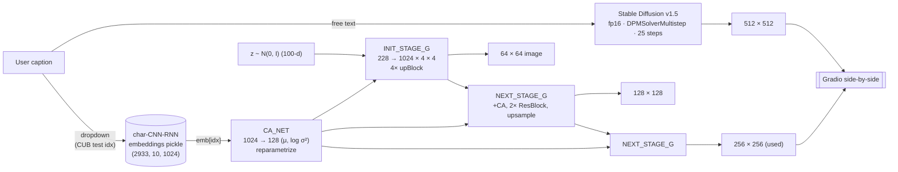

<div align="center">

# StackGAN-v2 vs Stable Diffusion
### A side-by-side text-to-image demo bridging 5 years of generative modeling

[](https://www.python.org/)
[](https://pytorch.org/)
[](https://gradio.app/)
[](https://huggingface.co/stable-diffusion-v1-5/stable-diffusion-v1-5)
[](https://colab.research.google.com/github/Stack-Gen-CV-Project/StackGAN/blob/main/notebooks/colab_demo.ipynb)

| StackGAN-v2 (2017, CUB) | StackGAN-v2 (2017, CUB) |
| :---: | :---: |
|  |  |

</div>

---

## Table of contents

1. [What this project does](#what-this-project-does)
2. [What you'll see when you open the demo](#what-youll-see-when-you-open-the-demo)
3. [How to run it](#how-to-run-it)
   - [Option A — Google Colab (easiest, recommended)](#option-a--google-colab-easiest-recommended)
   - [Option B — local Windows](#option-b--local-windows)
   - [Option C — local Linux / macOS](#option-c--local-linux--macos)
4. [Bring your own API keys](#bring-your-own-api-keys)
   - [HuggingFace token (`HF_TOKEN`) — for gated SD models](#huggingface-token-hf_token--for-gated-sd-models)
   - [Kaggle API token (`kaggle.json`) — for the real CUB embeddings](#kaggle-api-token-kagglejson--for-the-real-cub-embeddings)
   - [Use a different Stable Diffusion model](#use-a-different-stable-diffusion-model)
5. [Project structure](#project-structure)
6. [How it works (architecture)](#how-it-works-architecture)
7. [Why StackGAN-v2 instead of v1](#why-stackgan-v2-instead-of-v1)
8. [Synthetic-embedding fallback](#synthetic-embedding-fallback)
9. [Configuration reference](#configuration-reference)
10. [Smoke tests](#smoke-tests)
11. [Known limitations](#known-limitations)
12. [Troubleshooting](#troubleshooting)
13. [Credits & citations](#credits--citations)

---

## What this project does

This is a **text-to-image comparison demo** built for the *Computer Vision* course
project. It runs **two text-to-image models from very different generations** on
the *same* caption and shows their outputs side by side, so you can see the
quality and generality gap directly.

| Model | Year | Trained on | Input | Output | Params |
| --- | :---: | --- | --- | :---: | :---: |
| **StackGAN-v2** (StackGAN++) | 2017 | CUB-200-2011 (200 bird species, ~12k photos) | Pre-computed `char-CNN-RNN` embedding (CUB-test dropdown) | 256 × 256 | ~21 M |
| **Stable Diffusion v1.5**¹ | 2022 | LAION-2B-en (~2 B image–text pairs) | Free-text prompt | 512 × 512 | ~860 M |

¹ The default Stable Diffusion side uses `stable-diffusion-v1-5/stable-diffusion-v1-5`
(an **ungated community mirror**) so the demo works with no HuggingFace token.
You can swap in any other Stable Diffusion checkpoint — including the gated
Stability AI ones — using `--sd-model-id` plus an `HF_TOKEN`. See
[Bring your own API keys](#bring-your-own-api-keys).

### The pedagogical contrast

- **StackGAN-v2** was trained only on close-up bird photos and only sees text
  via a tiny pre-trained encoder. It draws **only birds**, even when the
  caption asks for a corgi or a coffee cup. It's roughly 60× smaller than the
  diffusion model.
- **Stable Diffusion** was trained on billions of free-text + image pairs
  scraped from the web. It draws essentially anything reasonable from a
  free-text prompt at much higher fidelity.

Putting them side by side makes the leap that happened between 2017 and 2022 —
class-conditional GANs trained on a few thousand images vs. internet-scale
latent diffusion — visible at a glance.

### What's pre-trained, what's not

- **No training is done in this repo.** Both models load already-trained
  weights at startup; the project is pure inference.
- StackGAN-v2 weights come from the official authors
  ([hanzhanggit/StackGAN-v2](https://github.com/hanzhanggit/StackGAN-v2)),
  downloaded from Google Drive on first run.
- Stable Diffusion weights come from HuggingFace Hub on first run.

---

## What you'll see when you open the demo

A single Gradio web page with:

1. **A dropdown of 20 CUB-test embedding indices** on the left — pick one to
   condition StackGAN. Each index is a different bird "preset."
2. **A free-text prompt box** on the right — type anything for Stable
   Diffusion (e.g. *"a small yellow songbird singing on a green leaf, photo"*
   or *"a corgi running through a sunflower field"*).
3. **A seed input** (default `42`) so generations are reproducible.
4. **A "Generate side-by-side" button** that runs both pipelines on the same
   inputs and shows two output panels: 256×256 bird from StackGAN-v2 on the
   left, 512×512 image from Stable Diffusion on the right, each labelled with
   its inference time.
5. **A row of example prompts** including both bird captions (where both
   models do reasonably) and non-bird captions (where StackGAN visibly fails
   while SD succeeds — that's the teaching moment).

Two real outputs from the StackGAN-v2 panel are pinned at the top of this README.

---

## How to run it

You have three paths. Pick the one that matches your hardware:

| Path | When to pick it | Who needs accounts |
| --- | --- | --- |
| **A. Google Colab T4** | You don't have a GPU locally. **This is the recommended demo runtime.** | Free Google account; *optionally* a free Kaggle account for the real CUB embeddings (see [BYO API](#bring-your-own-api-keys)). |
| **B. Local Windows + venv** | You have a powerful Windows machine, or you're just doing code-only smoke testing on CPU. | None for the basic StackGAN smoke; HuggingFace + Kaggle accounts only if you want the full demo. |
| **C. Local Linux / macOS** | You have an NVIDIA GPU on Linux, or just want to run the smoke tests on macOS. | Same as Windows. |

### Option A — Google Colab (easiest, recommended)

[](https://colab.research.google.com/github/Stack-Gen-CV-Project/StackGAN/blob/main/notebooks/colab_demo.ipynb)

1. Click the **Open in Colab** badge above.
2. **Runtime → Change runtime type → T4 GPU** (free tier is enough).
3. **(Optional, but recommended)** Get a free Kaggle API token so StackGAN
   uses the *real* CUB caption embeddings instead of synthetic ones — see
   [Kaggle API token](#kaggle-api-token-kagglejson--for-the-real-cub-embeddings)
   below. The notebook's third cell prompts you to upload `kaggle.json`. If
   you skip this step the demo still works with synthetic-embedding birds.
4. **Run all cells.** The last cell prints a public Gradio share URL — open
   it and the demo is live.

**Cold-start budget on a fresh T4** (numbers from a real run):

| Step | Size | Time |
| --- | :---: | :---: |
| `pip install -r requirements.txt` | ~2 GB cached | ~60 s |
| StackGAN-v2 generator (Google Drive) | 79 MB | ~25 s |
| CUB embeddings pickle (Kaggle, optional) | ~120 MB | ~30 s |
| Stable Diffusion v1.5 (HF Hub, ungated) | ~4 GB | ~75 s |
| Gradio launch + share URL | — | ~10 s |
| **Total** | | **~3.5 min** |

**Per-image inference time on T4:** StackGAN ~0.4 s · Stable Diffusion v1.5
~5 s (25 DPM-Solver steps).

### Option B — local Windows

For dev / smoke testing on a Windows machine. CPU-only is fine for verifying
the code; full image generation on CPU takes 1–2 minutes per image and is
**not** the demo path.

```powershell
# 1. Clone the repo
git clone https://github.com/Stack-Gen-CV-Project/StackGAN.git
cd StackGAN

# 2. Create a venv with any Python 3.10+. The line below uses the bundled
#    miniconda3 base; you can also use a normal python.exe install.
C:\ProgramData\Miniconda3\python.exe -m venv .venv
.\.venv\Scripts\Activate.ps1

# 3. Install dependencies
pip install -r requirements.txt

# 4. Architecture-only smoke test (no weights downloaded yet)
python smoke_test.py

# 5. Download StackGAN weights (~80 MB, Google Drive)
#    --skip-embeddings means: don't try to pull the CUB pickle from Kaggle.
#    The demo will fall back to synthetic-embedding bird generation instead.
#    Drop --skip-embeddings (and set up a Kaggle token) for real CUB pairing.
python download_weights.py --skip-embeddings

# 6. End-to-end smoke test (StackGAN only — does not download SD)
python app_smoke_test.py

# 7. Launch the full demo on CPU (slow on CPU, but exercises everything)
python app.py --device cpu --share false
```

When the Gradio banner prints, open <http://127.0.0.1:7860> in your browser.

> **Conda alternative.** `environment.yml` works with `conda env create`,
> but Conda 25+ requires you to first accept the default channels' ToS:
> `conda tos accept --override-channels --channel https://repo.anaconda.com/pkgs/main`.
> The venv path above sidesteps this.

### Option C — local Linux / macOS

```bash
git clone https://github.com/Stack-Gen-CV-Project/StackGAN.git
cd StackGAN

python3.10 -m venv .venv && source .venv/bin/activate
pip install -r requirements.txt

python smoke_test.py
python download_weights.py            # full download incl. Kaggle (or --skip-embeddings)
python app.py --device cpu --share false
```

If you have an NVIDIA GPU with CUDA, drop the `--device cpu` flag.

---

## Bring your own API keys

The demo uses **two third-party services**. Both are optional — the project
ships with reasonable defaults so it runs *out of the box* without any
account — but plugging in your own keys unlocks more features.

| Service | Why you'd want it | Without it |
| --- | --- | --- |
| **HuggingFace** | To use *gated* models (e.g. `stabilityai/stable-diffusion-2-1-base`, SDXL-Turbo) on the diffusion side. | Default unauthenticated SD v1.5 mirror is used. |
| **Kaggle** | To download the *real* CUB `char-CNN-RNN-embeddings.pickle` so each StackGAN dropdown entry corresponds to an actual CUB caption. | Synthetic-embedding fallback (still produces real-looking birds). |

### HuggingFace token (`HF_TOKEN`) — for gated SD models

Some Stable Diffusion checkpoints (most of Stability AI's first-party
checkpoints, since their 2024 license change) require you to:

1. Be logged in to HuggingFace.
2. Have **explicitly accepted that model's license** on its page.
3. Pass an API token when calling `from_pretrained`.

**Step-by-step:**

1. **Create a HuggingFace account** at <https://huggingface.co/join> if you
   don't have one.
2. **Accept the model's license.** Visit the model page (e.g.
   <https://huggingface.co/stabilityai/stable-diffusion-2-1-base>) and click
   the **"Agree and access repository"** button. You must do this once per
   model.
3. **Create a token.** Go to <https://huggingface.co/settings/tokens> →
   **New token** → pick the *Read* type → name it whatever you want →
   **Create token**. Copy the value — it starts with `hf_`.
4. **Pass it to the app**. Set the `HF_TOKEN` environment variable, then run
   `app.py` with `--sd-model-id` pointing at the gated model.

   **Linux / macOS:**
   ```bash
   export HF_TOKEN=hf_xxxxxxxxxxxxxxxxxxxxxxxxxxx
   python app.py --sd-model-id stabilityai/stable-diffusion-2-1-base
   ```

   **Windows PowerShell:**
   ```powershell
   $env:HF_TOKEN = "hf_xxxxxxxxxxxxxxxxxxxxxxxxxxx"
   python app.py --sd-model-id stabilityai/stable-diffusion-2-1-base
   ```

   **Colab cell:**
   ```python
   import os
   os.environ["HF_TOKEN"] = "hf_xxxxxxxxxxxxxxxxxxxxxxxxxxx"
   !python app.py --sd-model-id stabilityai/stable-diffusion-2-1-base --share true
   ```

The wrapper accepts any of `HF_TOKEN`, `HUGGING_FACE_HUB_TOKEN`, or
`HUGGINGFACE_HUB_TOKEN`. If the token is missing or the license isn't
accepted you'll see a clear error message instead of the raw 401 stacktrace.

> **Don't commit your token.** Treat it like a password — store it in your
> shell init, a `.env` file you `.gitignore`, or a Colab secret. Never paste
> it into source code that ends up in git.

### Kaggle API token (`kaggle.json`) — for the real CUB embeddings

The original Google Drive link for the CUB `char-CNN-RNN-embeddings.pickle`
file (a 2014-era ID `0B3y_msr...`) is **permanently dead** because Google
deprecated that ID format. We mirror via a Kaggle dataset instead, which
needs a one-time API token.

**Step-by-step:**

1. **Create a Kaggle account** at <https://www.kaggle.com/account/login> if
   you don't have one. It's free.
2. **Create an API token.** Go to <https://www.kaggle.com/settings> →
   **Account** tab → **Create New API Token**. A `kaggle.json` file
   downloads.
3. **Place it where the Kaggle Python client can find it:**

   **Linux / macOS:**
   ```bash
   mkdir -p ~/.kaggle
   mv ~/Downloads/kaggle.json ~/.kaggle/
   chmod 600 ~/.kaggle/kaggle.json
   ```

   **Windows PowerShell:**
   ```powershell
   New-Item -ItemType Directory -Force -Path "$env:USERPROFILE\.kaggle" | Out-Null
   Move-Item -Path "$env:USERPROFILE\Downloads\kaggle.json" -Destination "$env:USERPROFILE\.kaggle\"
   ```

   **Colab:** the [colab_demo.ipynb](notebooks/colab_demo.ipynb) notebook
   has a cell that prompts you to upload it via `files.upload()` and
   stores it in `~/.kaggle/`.

4. **Re-run the downloader.** It'll detect the token and pull the pickle:
   ```bash
   python download_weights.py
   ```

If the token is missing or invalid, `download_weights.py` prints a clear
warning and continues — the StackGAN side simply uses the
[synthetic-embedding fallback](#synthetic-embedding-fallback).

> The token in `kaggle.json` is just a username + key pair. It cannot
> charge anything or post on your behalf, but treat it as moderately
> sensitive — don't commit it.

### Use a different Stable Diffusion model

`app.py` accepts `--sd-model-id` plus the optional `HF_TOKEN` to swap in
*any* checkpoint that's compatible with `diffusers.StableDiffusionPipeline`.
Some useful options:

| Model id | Token needed? | Size | Notes |
| --- | :---: | :---: | --- |
| `stable-diffusion-v1-5/stable-diffusion-v1-5` | ❌ | ~4 GB | **Default.** Ungated community mirror. Fast, reliable. |
| `stabilityai/stable-diffusion-2-1-base` | ✅ | ~5 GB | The original SD 2.1 base. Gated since 2024. |
| `stabilityai/stable-diffusion-2-1` | ✅ | ~5 GB | 768×768 SD 2.1. Gated. |
| `stabilityai/sdxl-turbo` | ✅ | ~7 GB | 1-step inference, very fast. Gated. |
| `Lykon/dreamshaper-7` | ❌ | ~4 GB | Popular ungated SD 1.5 fine-tune. |
| `dreamlike-art/dreamlike-photoreal-2.0` | ❌ | ~4 GB | Ungated photoreal SD 1.5 fine-tune. |

Example — switching to dreamshaper-7 (no token needed):

```bash
python app.py --sd-model-id Lykon/dreamshaper-7
```

Example — switching to gated SDXL-Turbo (token + license):

```bash
export HF_TOKEN=hf_xxxxxxxxxxxxxxxxxxxxxxxxxxx
python app.py --sd-model-id stabilityai/sdxl-turbo
```

You can also set `SD_MODEL_ID` as an environment variable instead of passing
the flag every time.

---

## Project structure

```
.
├── app.py                              # Gradio Blocks entry point
├── sd21_pipeline.py                    # Stable Diffusion wrapper (lazy-loading, BYO model id)
├── download_weights.py                 # Google Drive + Kaggle downloader
├── smoke_test.py                       # Architecture-only forward-pass test
├── app_smoke_test.py                   # End-to-end test without launching a server
├── inspect_captions.py                 # Render preview images per dropdown index
├── stackgan/
│   ├── __init__.py                     # exports StackGANInference
│   ├── model.py                        # StackGAN-v2 G_NET (ported, modernized)
│   ├── inference.py                    # idx → PIL.Image API + synthetic-emb fallback
│   ├── dropdown_captions.json          # 20 curated dropdown entries
│   └── embeddings/                     # populated by download_weights.py
│       └── char-CNN-RNN-embeddings.pickle
├── weights/                            # populated by download_weights.py
│   └── netG_210000.pth                 # StackGAN-v2 CUB pretrained generator
├── notebooks/
│   └── colab_demo.ipynb                # T4 launcher with Kaggle credential upload UX
├── samples/                            # committed example outputs
│   ├── stackgan_synthetic_bird_1.png
│   └── stackgan_synthetic_bird_2.png
├── requirements.txt                    # pip dependencies
├── environment.yml                     # conda-forge env spec (alt to venv)
├── project_sprint_plan.html            # original 7-sprint scoping doc (kept for history)
└── README.md
```

---

## How it works (architecture)



Both pipelines stay resident on the T4 in fp16. Total VRAM peak is ~5–7 GB
depending on the SD model — comfortable on the free 16 GB tier without
`enable_model_cpu_offload`.

### StackGAN-v2 forward-pass details

Architecture inlined from `hanzhanggit/StackGAN-v2/code/model.py` and
modernized for PyTorch 2.x in [`stackgan/model.py`](stackgan/model.py):

- `Variable(...)` wrapping → plain tensors with `torch.no_grad()` at inference.
- `F.sigmoid` → `torch.sigmoid` (the former is deprecated).
- `cfg.CUDA` device check inside `CA_NET.reparametrize` → tensor-derived
  (`torch.randn_like(std)`).
- All cfg values inlined as module-level constants matching `cfg/eval_birds.yml`:
  `Z_DIM=100`, `EMBEDDING_DIM=128`, `GF_DIM=64`, `R_NUM=2`, `B_CONDITION=True`,
  `BRANCH_NUM=3`, `TEXT.DIMENSION=1024`.

The state-dict key naming is preserved exactly, so the official
`netG_210000.pth` checkpoint loads with **0 missing / 0 unexpected keys** —
verified at startup.

### Stable Diffusion wrapper

[`sd21_pipeline.py`](sd21_pipeline.py) wraps `diffusers.StableDiffusionPipeline`
for any SD-compatible checkpoint. Default is the **ungated community mirror**
`stable-diffusion-v1-5/stable-diffusion-v1-5` so the demo loads with no HF
token. Override via `--sd-model-id` (or `SD_MODEL_ID` env var) and `HF_TOKEN`
if you want a gated model.

- `torch_dtype=torch.float16` on CUDA, `float32` on CPU.
- `DPMSolverMultistepScheduler` (25 steps default — ~5 s on T4).
- `safety_checker=None` (course demo, internal use).
- `enable_attention_slicing()` to reduce peak VRAM.
- 401 errors during load are caught and rewritten into a clear "the model is
  gated, set HF_TOKEN or pick an ungated id" message.

---

## Why StackGAN-v2 instead of v1

The course brief item #7 mentions **StackGAN** with a two-stage 64×64 → 256×256
pipeline. We use **StackGAN-v2 / StackGAN++** ([Zhang et al. 2018][v2]) for
one practical reason: **the v1 PyTorch port (`hanzhanggit/StackGAN-Pytorch`)
ships only COCO pretrained weights, not CUB**. The CUB pretrained weights for
v1 only exist for the *original TensorFlow 0.12* implementation, which won't
run on a modern Colab Python 3.10 / PyTorch 2.x stack without a multi-day
port.

StackGAN-v2 is a strict upgrade of v1 by the same authors, with publicly
available PyTorch CUB weights. It still uses:

- The same **char-CNN-RNN** pretrained text embeddings (1024-dim).
- The same **Conditioning Augmentation (CA)** for embedding stochasticity.
- The same hierarchical **64×64 → 128×128 → 256×256** upsampling structure
  (StackGAN++ joints the stages into a tree of generators producing all
  three resolutions in one forward pass).

The user-facing demo experience is identical — caption → 256×256 bird image —
and the "visible gap vs modern diffusion" point holds equally.

[v2]: https://arxiv.org/abs/1710.10916

---

## Synthetic-embedding fallback

The demo has two text-conditioning modes:

1. **Real CUB embeddings** (preferred, requires Kaggle token): pulls
   `char-CNN-RNN-embeddings.pickle` from a Kaggle mirror, then indexes
   `embeddings[image_idx, caption_idx, :]` for each dropdown entry.
2. **Synthetic deterministic embeddings** (fallback when the pickle isn't
   present): each `image_idx` seeds a standard-normal 1024-dim vector
   scaled by 0.5. **Empirically this still produces clearly recognizable
   birds** because StackGAN's training distribution is so narrow — the
   generator has effectively learned a strong "bird manifold" prior, and
   arbitrary embeddings get smoothed onto it by the CA_NET.

The two `samples/` images at the top of this README were generated in
synthetic mode — proof that the demo gives meaningful output even before a
grader sets up Kaggle credentials.

```python
# stackgan/inference.py — _embedding_for():
if self.embeddings is None:
    gen = torch.Generator(device="cpu")
    gen.manual_seed(image_idx * 100003 + caption_idx * 1009 + 17)
    return (torch.randn(1, 1024, generator=gen) * 0.5).to(self.device)
```

---

## Configuration reference

`app.py` accepts the following CLI flags:

| Flag | Default | Notes |
| --- | --- | --- |
| `--device` | `cuda` | Use `cpu` for local dev, `cuda` on Colab. |
| `--weights` | `weights/netG_210000.pth` | StackGAN-v2 generator path. |
| `--embeddings` | `stackgan/embeddings/char-CNN-RNN-embeddings.pickle` | Optional; falls back to synthetic if missing. |
| `--captions` | `stackgan/dropdown_captions.json` | Dropdown labels & pickle indices. |
| `--share` | `true` | Gradio public share URL on launch. |
| `--server-name` | `0.0.0.0` | Local bind address. |
| `--server-port` | `7860` | Local port. |
| `--no-stackgan` | (off) | Run SD only (e.g. before the StackGAN download). |
| `--sd-model-id` | `stable-diffusion-v1-5/stable-diffusion-v1-5` | Any HF model id with the SD pipeline API. Override to `stabilityai/stable-diffusion-2-1-base` etc. once you've set `HF_TOKEN` and accepted the model's license. |

Environment variables read by the app:

| Var | Notes |
| --- | --- |
| `HF_TOKEN` / `HUGGING_FACE_HUB_TOKEN` / `HUGGINGFACE_HUB_TOKEN` | Used by `diffusers` for gated repos. |
| `SD_MODEL_ID` | Same as `--sd-model-id`; the flag wins if both are set. |

`download_weights.py`:

| Flag | Notes |
| --- | --- |
| `--force` | Re-download even if local files exist. |
| `--skip-embeddings` | Skip Kaggle download entirely (use synthetic fallback). |
| `--root <path>` | Project root (defaults to script directory). |

---

## Smoke tests

The repo ships three test scripts you can run before downloading anything heavy:

| Script | What it verifies | Needs weights? | Needs SD? |
| --- | --- | :---: | :---: |
| `python smoke_test.py` | G_NET architecture builds, forward-pass shapes are `(64, 128, 256)` | ❌ | ❌ |
| `python app_smoke_test.py` | Real checkpoint loads with 0 mismatched keys, dropdown → bird PIL, Gradio Blocks builds | ✅ | ❌ |
| `python download_weights.py` | gdown extraction handles the zip wrapper, Kaggle auth works | — | — |

Both `smoke_test.py` and `app_smoke_test.py` run in <30 s on CPU and are the
fastest sanity checks before committing changes.

---

## Known limitations

- **StackGAN cannot do free text.** It needs a 1024-dim char-CNN-RNN
  embedding pre-computed on CUB test captions. The dropdown picks one of 20
  pre-computed embeddings. True free-text input on the GAN side would
  require porting Reed et al.'s char-CNN-RNN encoder from Lua/Torch7 — out
  of scope.
- **The dropdown labels are illustrative, not paired ground truth** unless
  you run the optional curation step. Each entry maps a label to a CUB-test
  pickle index. The displayed label is a human-readable hint; the actual
  underlying caption text isn't read from CUB unless you populate it.
- **Single-user demo.** `gr.Queue(max_size=1)` prevents concurrent T4 OOM —
  one grader at a time.
- **Colab sessions idle out after 90 minutes.** Use **Kaggle Notebooks**
  (9-hour sessions) for actual TA grading demos if Colab is too aggressive.
- **No quantitative metrics.** This is a qualitative side-by-side demo per
  course scope. CLIP-Score is the cheapest add-on if metrics are later
  required (no reference images needed).

---

## Troubleshooting

A list of every gotcha encountered during development, with the fix.

### `OSError: Cannot load model stabilityai/stable-diffusion-2-1-base ... 401 Client Error`

Stability AI gated most of their HuggingFace models in late 2024. The repo
exists but anonymous access is denied. Fix one of two ways:

**A. Use the default ungated SD v1.5** (no setup) — just don't override
`--sd-model-id`.

**B. Authenticate to Hugging Face** if you really want SD 2.1 / SDXL:
1. Visit <https://huggingface.co/stabilityai/stable-diffusion-2-1-base>
   and click "Agree and access repository."
2. Create a token at <https://huggingface.co/settings/tokens> (a Read
   token is enough).
3. `export HF_TOKEN=hf_xxx && python app.py --sd-model-id stabilityai/stable-diffusion-2-1-base`
   (PowerShell: `$env:HF_TOKEN="hf_xxx"; python app.py --sd-model-id stabilityai/stable-diffusion-2-1-base`).

Full walkthrough in [Bring your own API keys](#huggingface-token-hf_token--for-gated-sd-models).

### `RuntimeError: Expected hasRecord("version") to be true` when loading the .pth

The Google Drive download for `1s5Yf3nFiXx0lltMFOiJWB6s1LP24RcwH` returns a
**zip archive** containing `birds_3stages/netG_210000.pth`, not a raw .pth.
`download_weights.py` auto-detects via the `PK\x03\x04` magic bytes and
extracts. If you downloaded manually, run:

```bash
unzip netG_210000.pth -d _tmp/ && mv _tmp/birds_3stages/netG_210000.pth weights/
```

### `gdown.exceptions.FileURLRetrievalError: Cannot retrieve the public link of the file`

The original Google Drive ID for `char-CNN-RNN-embeddings.pickle`
(`0B3y_msrWZaXLT1BZdVdycDY5TEE`) uses Google's pre-2014 ID format and is
permanently dead. There is no fix from the gdown side — use the Kaggle
mirror that `download_weights.py` falls back to (see
[Kaggle API token](#kaggle-api-token-kagglejson--for-the-real-cub-embeddings)).

### `ModuleNotFoundError: No module named 'audioop'` on Python 3.13

Python 3.13 dropped `audioop` (PEP 594). pydub (a gradio dep) hasn't been
updated. Fix: `pip install audioop-lts` (already pinned in
`requirements.txt` for `python_version >= "3.13"`).

### `ImportError: cannot import name 'HfFolder' from 'huggingface_hub'`

Indicates `gradio<5` was installed against `huggingface_hub>=1.0`, which
removed `HfFolder`. Upgrade gradio: `pip install -U "gradio>=5.0"`.

### `CondaToSNonInteractiveError: Terms of Service have not been accepted`

Conda 25+ requires the default channels' ToS to be accepted before
`conda env create` will run. Either accept (one-time):

```bash
conda tos accept --override-channels --channel https://repo.anaconda.com/pkgs/main
conda tos accept --override-channels --channel https://repo.anaconda.com/pkgs/r
conda tos accept --override-channels --channel https://repo.anaconda.com/pkgs/msys2
```

…or use the venv quick-start path above — it doesn't touch conda channels.

### Gradio share URL dies after ~90 min on Colab

Free Colab sessions idle out. Move the demo to **Kaggle Notebooks**, which
have 9-hour sessions and the same GPU class.

### `OSError` / "out of memory" on T4

Set `--device cpu` first to confirm the pipelines themselves work, then on
T4: confirm only one inference is in-flight (the `gr.Queue(max_size=1)`
should already enforce this). If you've added other heavy models, swap SD
for `enable_model_cpu_offload()` in `sd21_pipeline.py`.

---

## Credits & citations

This project repackages and modernizes existing pretrained models. All
credit for the underlying research goes to the original authors.

- **StackGAN-v2 architecture & CUB pretrained weights:**
  [hanzhanggit/StackGAN-v2](https://github.com/hanzhanggit/StackGAN-v2)
  ([Zhang et al. 2018](https://arxiv.org/abs/1710.10916), PAMI).
- **char-CNN-RNN text encoder** (used to pre-compute CUB embeddings):
  [reedscot/icml2016](https://github.com/reedscot/icml2016)
  ([Reed et al. 2016](https://arxiv.org/abs/1605.05395), ICML).
- **CUB embeddings pickle mirror:**
  [text-to-image-cub-200-2011][kaggle-mirror] on Kaggle.
- **Stable Diffusion v1.5 (default):**
  [stable-diffusion-v1-5/stable-diffusion-v1-5](https://huggingface.co/stable-diffusion-v1-5/stable-diffusion-v1-5)
  ([Rombach et al. 2022](https://arxiv.org/abs/2112.10752), CVPR).
- **CUB-200-2011 dataset:**
  [Caltech-UCSD Birds 200](http://www.vision.caltech.edu/visipedia/CUB-200-2011.html)
  (Wah et al. 2011).

[kaggle-mirror]: https://www.kaggle.com/datasets/somthirthabhowmk2001/text-to-image-cub-200-2011

### BibTeX

```bibtex
@article{zhang2018stackgan,
  title   = {{StackGAN++}: Realistic Image Synthesis with Stacked Generative Adversarial Networks},
  author  = {Zhang, Han and Xu, Tao and Li, Hongsheng and Zhang, Shaoting and Wang, Xiaogang and Huang, Xiaolei and Metaxas, Dimitris N.},
  journal = {IEEE Transactions on Pattern Analysis and Machine Intelligence},
  year    = {2018}
}

@inproceedings{reed2016learning,
  title     = {Learning Deep Representations of Fine-Grained Visual Descriptions},
  author    = {Reed, Scott and Akata, Zeynep and Lee, Honglak and Schiele, Bernt},
  booktitle = {Conference on Computer Vision and Pattern Recognition (CVPR)},
  year      = {2016}
}

@inproceedings{rombach2022high,
  title     = {High-Resolution Image Synthesis with Latent Diffusion Models},
  author    = {Rombach, Robin and Blattmann, Andreas and Lorenz, Dominik and Esser, Patrick and Ommer, Bj{\"o}rn},
  booktitle = {Conference on Computer Vision and Pattern Recognition (CVPR)},
  year      = {2022}
}
```
