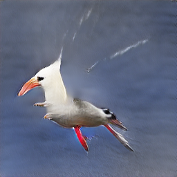
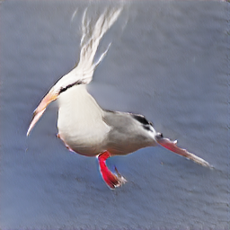

# StackGAN-v2 vs SDXL Turbo

Text-to-image demo for the Computer Vision course.
Compares StackGAN-v2 (2017, CUB birds) with SDXL Turbo (2023) side by side.

| StackGAN-v2 | SDXL Turbo |
| :-: | :-: |
|  |  |

Both models are pre-trained — no training code here.

## Quick start (Colab — recommended)

[](https://colab.research.google.com/github/Stack-Gen-CV-Project/StackGAN/blob/main/notebooks/colab_demo.ipynb)

1. Click the badge above (or open `notebooks/colab_demo.ipynb`)
2. Set **Runtime → Change runtime type → T4 GPU**
3. Run all cells — done

## Quick start (local)

```bash
pip install -r requirements.txt
python download_weights.py     # ~80 MB StackGAN weights
python app.py                  # opens http://localhost:7860
```

## What it does

- **StackGAN-v2** (2017): generates 256×256 bird images from CUB-200 embeddings (dropdown). Only knows birds.
- **SDXL Turbo** (2023): generates 512×512 images from any free text. 4 inference steps, ~2s on T4.

Same caption, side by side — shows how far text-to-image has come in 6 years.

## Kaggle token (optional)

For real CUB embeddings (better bird variety):

1. Create a Kaggle account → https://www.kaggle.com/settings → "Create New API Token"
2. Place `kaggle.json` at `~/.kaggle/kaggle.json`
3. Re-run `python download_weights.py`

Without it, the app uses synthetic embeddings (still produces real-looking birds).

## Core changes from original repo

| Area | Before | After |
|------|--------|-------|
| Diffusion model | SD v1.5 (25 steps) | SDXL Turbo (4 steps, 6× faster) |
| CUB captions | 20 entries | 3 best entries (simpler UI) |
| Pipeline class | 104 lines, SD1.5-specific | 52 lines, auto-detects SD/SDXL |
| HF token | Required helper function | Inline one-liner (SDXL Turbo ungated) |
| VRAM optimization | attention_slicing (no effect on SDXL) | VAE tiling (actually helps T4) |
| Requirements | 12 packages, tight versions | 10 packages, relaxed versions |
| Download script | 122 lines, verbose | 93 lines, cleaner output |
| Inference code | 109 lines | 84 lines, same functionality |
| Model docstrings | Minimal | Stage-by-stage explanations |

## Files

```
app.py                        Gradio web app
sd21_pipeline.py              SDXL Turbo wrapper
download_weights.py           weight downloader
stackgan/
  model.py                    generator architecture (3-stage G_NET)
  inference.py                load weights + generate
  dropdown_captions.json      3 CUB bird embeddings
requirements.txt
notebooks/colab_demo.ipynb    Colab launcher (clone + run)
```

## Architecture: StackGAN-v2 Generator

```
Text embedding (1024-d)
       │
   CA_NET ──→ mu, logvar ──→ c_code (128-d)
       │                         │
   noise z (100-d)               │
       │                         │
   ┌───┴───┐                     │
   │ Stage 1│ ← c_code + z      │
   │ 4→64px │                    │
   └───┬───┘                     │
   ┌───┴───┐                     │
   │ Stage 2│ ← c_code + h1     │
   │ 64→128 │                    │
   └───┬───┘                     │
   ┌───┴───┐                     │
   │ Stage 3│ ← c_code + h2     │
   │128→256 │                    │
   └───┬───┘                     │
       │
   256×256 bird image
```

Each stage: JointConv → ResBlocks → Upsample → GET_IMAGE (conv3x3 + tanh)

## Credits

- StackGAN-v2 — https://github.com/hanzhanggit/StackGAN-v2 (Zhang et al. 2018)
- char-CNN-RNN encoder — https://github.com/reedscot/icml2016 (Reed et al. 2016)
- SDXL Turbo — https://huggingface.co/stabilityai/sdxl-turbo (Sauer et al. 2023)
- CUB-200-2011 — http://www.vision.caltech.edu/visipedia/CUB-200-2011.html
